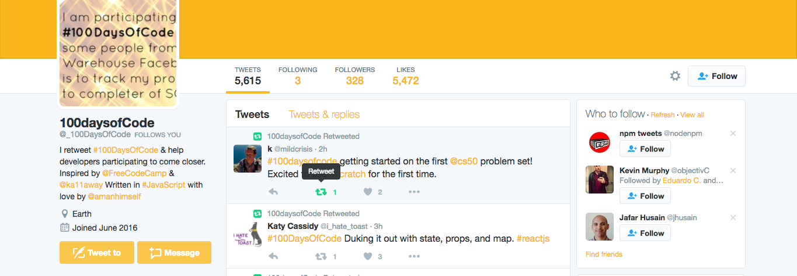
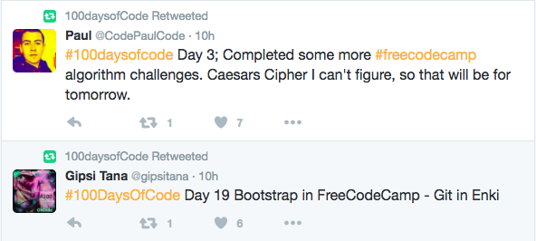
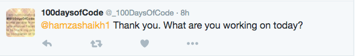

# [100DaysOfCode Twitter Bot](https://twitter.com/hashtag/100DaysOfCode?src=hash)

Helping Developers who code and participate in [#100DaysOfCode](https://twitter.com/hashtag/100DaysOfCode?src=hash) share and communicate through Twitter.

# What can this bot do?

## Retweet & Like a Tweet

## When Followed, automated reply to the user

## Congratulating user on starting/finishing #100DaysOfCode Challenge
[Imgur](http://i.imgur.com/d8pu9LO.png)

## Pre-requisites

This bot uses the `twit` npm package to manipulate tweets and streams and communicate with Twitter API. Please refer [documentation](https://github.com/ttezel/twit) to make substantial changes.

## Contributing

You can help out by:

- Solving exisiting issues
- Enhancing the bot adding more functionalities (see issues)
- Pointing out bugs/errors

For above option(s), please create an issue so it can be addressed. New to GitHub issues? They have a pretty handy guide you can use to familiarize yourself with them.

#### If You Can Make the Change
Simply do:
- Fork the repository
- Make your suggested change
- Make sure the code style looks similar to the existing code
- Create a pull request

--- 

### License

BSD 3-Clause License

Copyright (c) 2017, Free Code Camp. All rights reserved.
